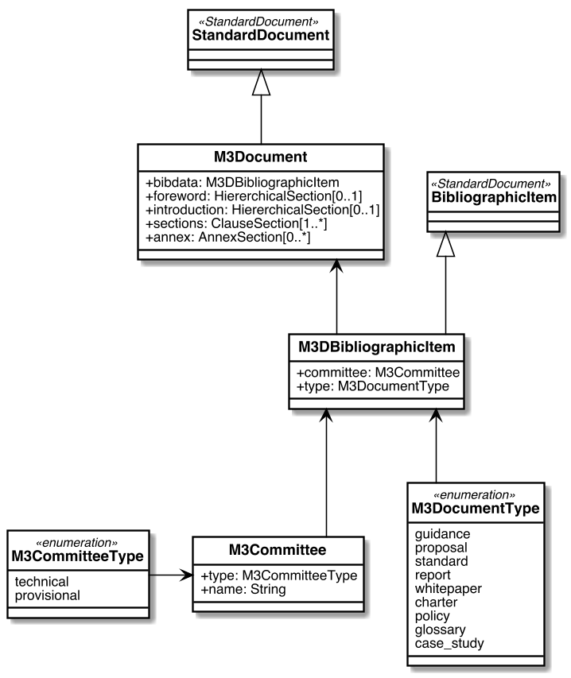

= Metanorma M3AAWG Document ("M3D") Models

image:https://github.com/metanorma/metanorma-model-m3d/workflows/ubuntu/badge.svg["Ubuntu Build Status", link="https://github.com/metanorma/metanorma-model-m3d/actions?query=workflow%3Aubuntu"]
image:https://github.com/metanorma/metanorma-model-m3d/workflows/macos/badge.svg["OSX Build Status", link="https://github.com/metanorma/metanorma-model-m3d/actions?query=workflow%3Amacos"]
image:https://github.com/metanorma/metanorma-model-m3d/workflows/windows/badge.svg["Windows Build Status", link="https://github.com/metanorma/metanorma-model-m3d/actions?query=workflow%3Awindows"]

This is where we keep the Metanorma M3D model definitions.

The M3AAWG Document ("`M3D`") format is an instance of the
https://github.com/metanorma/metanorma-model-standoc[Metanorma StandardDocument model].
Details of the general model can be found on its page.

== M3AAWG Document Model

