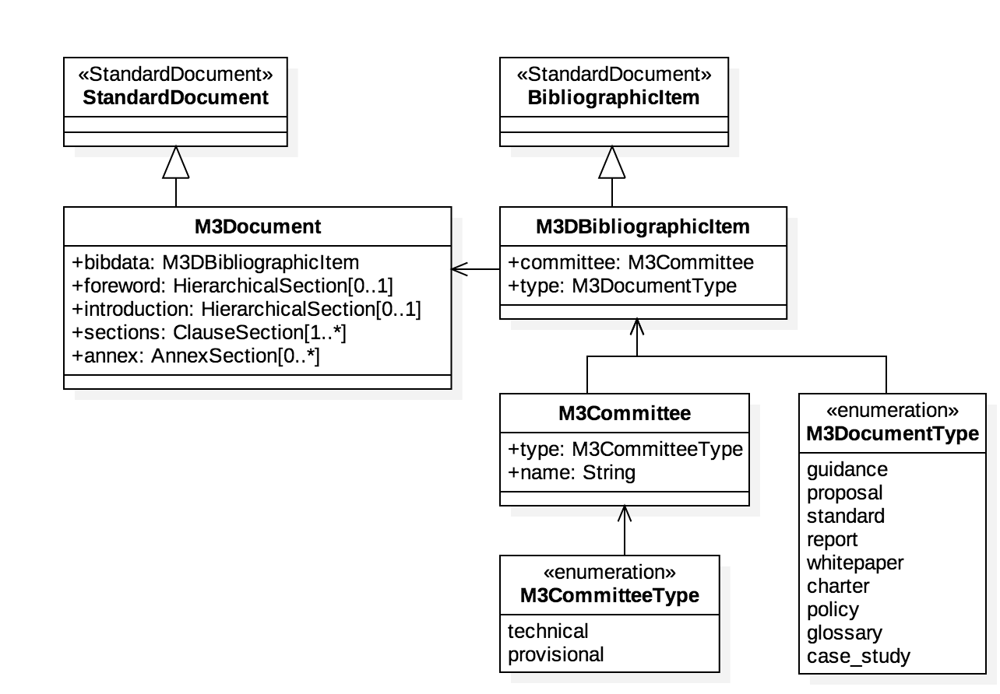

= Metanorma M3AAWG Document ("M3D") Models

This is where we keep the Metanorma M3D model definitions.

The M3AAWG Document ("M3D") format is an instance of the
https://github.com/riboseinc/standoc-models[Metanorma StandardDocument model].
Details of the general model can be found on its page.

== M3AAWG Document Model

